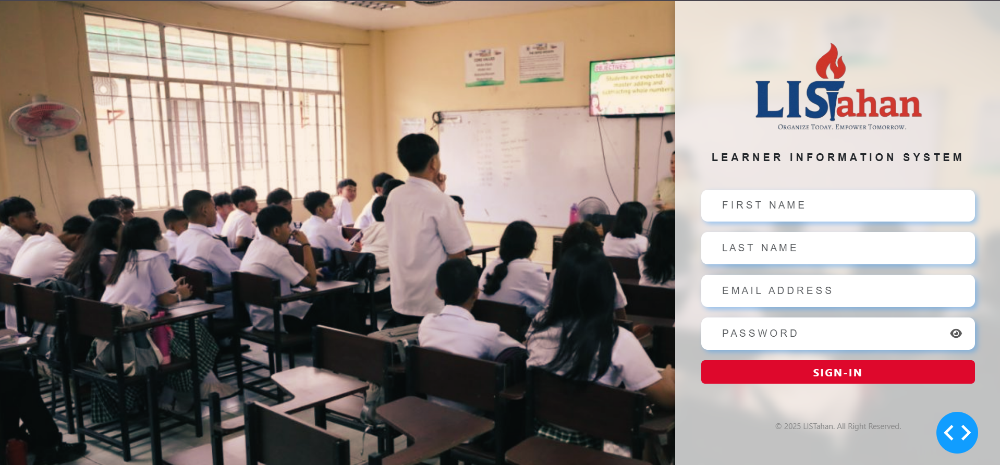

# Learner Information System Dashboard

README-Updated: **2025-05-15**

## Project Overview
The Learner Information System Dashboard is a web-based application built using Python and the Dash framework. It provides a user-friendly interface for managing and visualizing learner information, offering features like dashboards, analytics, and customizable settings.

---


## Project Structure
```plaintext
learner_dashboard/
├── app.py                   # Main Dash app
├── assets/
│   ├── style.css            # Custom CSS filepreview of md file in vs code
├── layout/
│   ├── sidebar.py           # Sidebar layout and menu items
│   ├── page_router.py       # Handles page routing
│   ├── cards.py             # Card component for displaying information
│   ├── header.py            # Header component
│   └── pages/
│       ├── dashboard.py     # Dashboard page
│       ├── enrollment.py    # Enrollment page
│       ├── help.py          # Help page
│       └── settings.py      # Settings page
├── data_files/              # Data files (CSV, JSON, etc.)
│   └── user-info.csv        # Example user data
├── requirements.txt         # Dependencies like Dash, Plotly, etc.
└── README.md                # Project documentation
```

---

## Features

* **Dashboard**: An overview page with key metrics and insights.
* **Analytics**: Placeholder for exploring and analyzing learner-related data.
* **Help**: Guidance and information about using the application.
* **Settings**: Configure application settings, including account and general settings.
* **Collapsible Sidebar**: A navigation sidebar that can be collapsed for more screen real estate.
* **Dynamic Greeting**: Displays a personalized greeting based on the time of day.
* **Responsive Design**: Adapts to different screen sizes for better usability.

---

## Technologies Used

* **Python**: The primary programming language.
* **Dash**: A Python framework for building analytical web applications.
* **Dash Bootstrap Components (dbc)**: A library of Bootstrap components for Dash.
* **Pandas**: For data manipulation and analysis.
* **Plotly**: For creating interactive charts and graphs.

---

## Prerequisites

* **Python 3.x** installed on your system.
* **pip** (Python package installer) installed.

---

## Installation

1. **Clone the repository**:
    ```bash
    git clone <repository_url>
    cd learner_dashboard
    ```

2. **Create a virtual environment (recommended)**:
    ```bash
    python -m venv venv
    source venv/bin/activate  # On macOS/Linux
    venv\Scripts\activate  # On Windows
    ```

3. **Install the required dependencies**:
    ```bash
    pip install -r requirements.txt
    ```

---

## Running the Application

1. **Navigate to the project directory in your terminal**.
2. **Run the `app.py` file**:
    ```bash
    python app.py
    ```
3. **Open your web browser and go to `http://127.0.0.1:8050/`** (or the address shown in your terminal).

---

## Configuration

* **Custom Styling**: Modify the `assets/style.css` file to customize the application's appearance.
* **Temporary Constants**: Replace placeholder data in `layout/temp_constants.py` with actual data or implement a dynamic way to fetch this information.
* **Sidebar Menu**: Add, remove, or modify menu items in the `create_sidebar` function in `layout/sidebar.py`.

---

## Contributing

Contributions to this project are welcome. Please follow these steps:

1. Fork the repository.
2. Create a new branch for your feature or bug fix.
3. Make your changes and commit them.
4. Push your changes to your fork.
5. Submit a pull request.

---

## License

This project is currently not licensed. Please contact the repository owner(or collaborators) for more information.

---

## Acknowledgements

* Built using the Dash framework by Plotly.
* Utilizes Bootstrap styling through Dash Bootstrap Components.

---

## Further Development

Future enhancements could include:

* Implementing the analytics page with actual data visualization.
* Adding functionality to the help and settings pages.
* Completing the dark mode theme implementation.
* Implementing user authentication and authorization.
* Connecting to a real database to fetch and manage learner information.
* Improving the responsiveness and overall UI/UX.